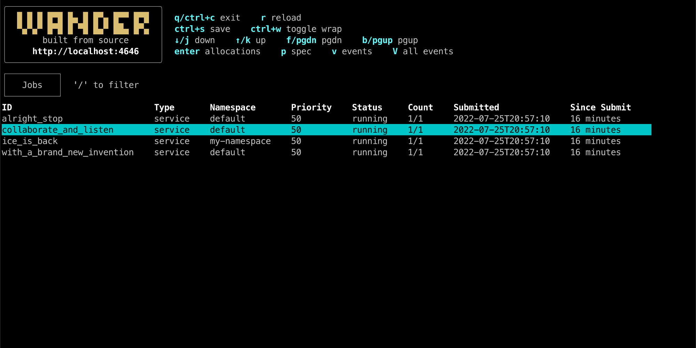
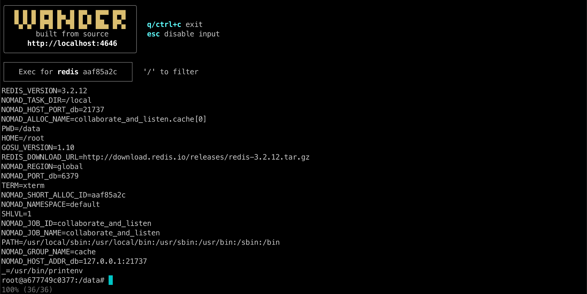
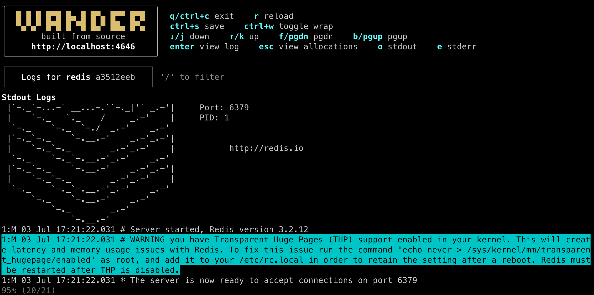
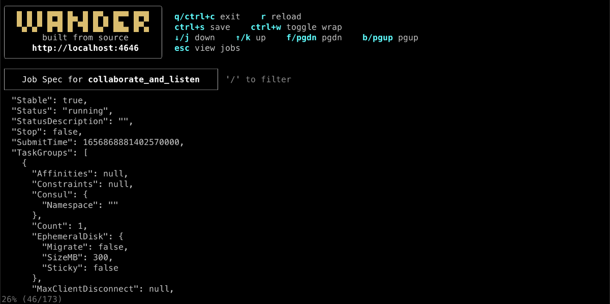

# Wander - a terminal app for [HashiCorp Nomad](https://www.nomadproject.io/)

### Browse jobs



### View allocations and tasks


### Exec to run commands in a running task



### View and search logs



### Save any view as a local file


### See full specs



`wander` is written with tools from [Charm](https://charm.sh/).
[Feature requests and bug reports for wander are welcome](https://github.com/robinovitch61/wander/issues/new/choose).

## Installation

### > Using homebrew

```shell
brew install robinovitch61/tap/wander
```

### > Download from GitHub

Download the relevant binary for your operating system (macOS = Darwin) from
the [latest Github release](https://github.com/robinovitch61/wander/releases). Unpack it, then move the binary to
somewhere accessible in your `PATH`, e.g. `mv ./wander /usr/local/bin`.

### > Using [go installed on your machine](https://go.dev/doc/install)

```shell
go install github.com/robinovitch61/wander@latest
```

### > Build from source

Clone this repo, build from source with `cd <cloned_repo> && go build`,
then move the binary to somewhere accessible in your `PATH`, e.g. `mv ./wander /usr/local/bin`.

## Usage

Run the app by running `wander` in a terminal. See `wander --help` and config section below for details.

## Configuration

`wander` can be configured in three ways:

- command line arguments, visible by running `wander --help`
- environment variables. These map to the configuration file below (e.g. `nomad_addr` in yaml is the `NOMAD_ADDR` environment variable)
- a yaml config file at `$HOME/.wander.yaml`, or a custom config file path passed to the `--config` argument (example below)

Priority in order of highest to lowest is command line arguments, then environment variables, then the config file.

Example yaml file showing all options:

```shell
# required: nomad address
nomad_addr: http://localhost:4646

# optional: nomad token (default "")
nomad_token: <your-nomad-token>

# optional (default 2): update interval for jobs and allocations data. Disable by setting to -1
wander_update_seconds: 1

# only relevant for `wander serve` - the host of the machine serving the ssh app
wander_host: localhost

# only relevant for `wander serve` - the port for the ssh app
wander_port: 21324
```

## SSH App

`wander` can be served via ssh application. For example, you could host an internal ssh application for your company
such that anyone on the internal network can `ssh -p <your-port> <your-host>` and immediately access `wander` without
installing or configuring anything.

Optionally, users can pass in their own nomad token with `ssh -p <port> <host> -t <token>`. The `-t` argument does not
stand for
token - it forces `ssh` to allocate a pty.

Serve the ssh app with `wander serve`.

## Trying It Out

You can try `wander` out by running a local nomad cluster in dev mode
following [these instructions](https://learn.hashicorp.com/tutorials/nomad/get-started-run?in=nomad/get-started):

```sh
# in first terminal session, start and leave nomad running in dev mode
sudo nomad agent -dev -bind 0.0.0.0 -log-level INFO

# in a different terminal session, create example job and run it
nomad job init
nomad job run example.nomad

# run wander
wander -a http://localhost:4646
```

## Development

The `scripts/dev.sh` script watches the source code and rebuilds the app on changes
using [entr](https://github.com/eradman/entr).

`wander` runs the built app. You must rerun it on rebuild.

If the `WANDER_DEBUG` environment variable is set to `true`, the `dev.Debug(s string)` function outputs logs
to `wander.log`.
