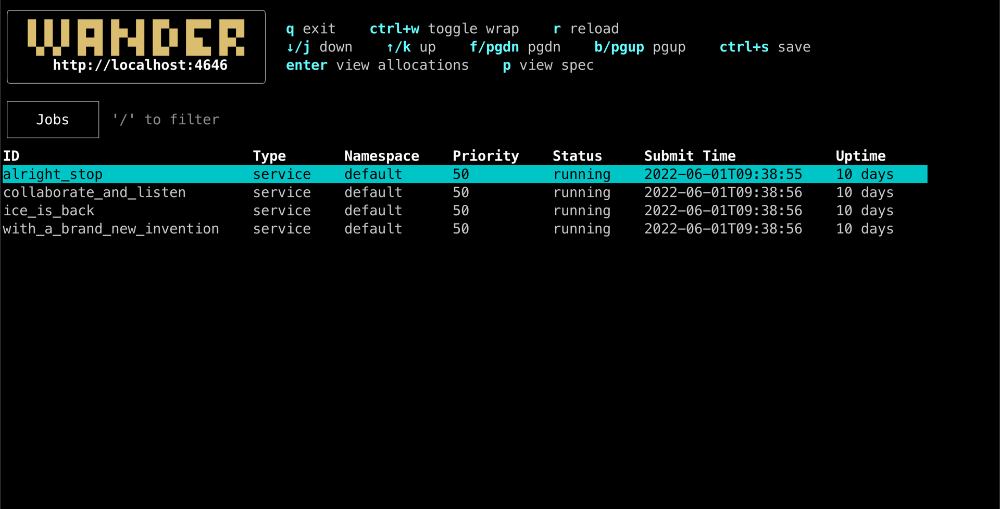
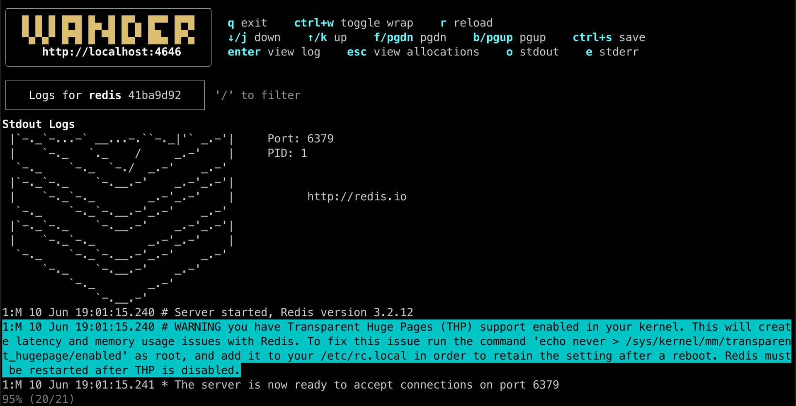

# wander: a terminal app for [Nomad by HashiCorp](https://www.nomadproject.io/)

<p align="center"><strong>Click <a href="https://robinovitch61-cdn.s3.us-west-2.amazonaws.com/wander.gif">here</a> or any image to view full demo</strong></p>

Browse jobs, allocations, and tasks
[](https://robinovitch61-cdn.s3.us-west-2.amazonaws.com/wander.gif)
Navigate, search, and save logs
[](https://robinovitch61-cdn.s3.us-west-2.amazonaws.com/wander.gif)

`wander` currently supports viewing jobs, allocations, tasks, and logs across a Nomad cluster.

It is written with the [Bubble Tea TUI framework from Charm](https://github.com/charmbracelet/bubbletea), and is in
active development. Expect near term improvements. Feature requests in the form of issues are welcome.

## Installation

### homebrew

```shell
brew install robinovitch61/tap/wander
````

### using [go installed on your machine](https://go.dev/doc/install)

```shell
go install github.com/robinovitch61/wander@latest
```

### download from github

Download the relevant asset for your operating system from
the [latest Github release](https://github.com/robinovitch61/wander/releases). Unpack it, then move the binary to
somewhere accessible in your `PATH`, e.g. `mv ./wander /usr/local/bin`.

### build from source

Clone this repo, build from source with `cd <cloned_repo> && go build`,
then move the binary to somewhere accessible in your `PATH`, e.g. `mv ./wander /usr/local/bin`.

## Usage

Run the app by running `wander` in a terminal. See `wander --help` and config section below for details.

## Configuration

`wander` can be configured in a yaml file at `$HOME/.wander.yaml` or a file path passed to the `--config` argument.

Example yaml file:

```shell
# required: nomad address
wander_addr: http://localhost:4646

# required: nomad token
wander_token: nomad_token

# only relevant for `wander serve` - the host of the machine serving the ssh app
wander_host: localhost

# only relevant for `wander serve` - the port for the ssh app
wander_port: 21324
```

Alternatively, `wander` can be configured via environment variables (e.g. `wander_addr` in yaml above becomes the
`WANDER_ADDR` environment variable), or via command line args visible by running `wander --help`.

## Trying It Out

You can try `wander` out by running a local nomad cluster in dev mode
following [these instructions](https://learn.hashicorp.com/tutorials/nomad/get-started-run?in=nomad/get-started):

```sh
# in first terminal session, start and leave nomad running in dev mode
sudo nomad agent -dev -bind 0.0.0.0 -log-level INFO

# in a different terminal session, create example job and run it
nomad job init
nomad job run example.nomad

# run wander
NOMAD_ADDR=http://localhost:4646 NOMAD_TOKEN="blank" wander
```

## SSH App

`wander` can be served via ssh application. For example, you could host an internal ssh application for your company
such that anyone on the internal network can `ssh -p <your-port> <your-host>` and immediately access `wander` without
installing or configuring anything.

Optionally, users can pass in their own nomad token with `ssh -p <port> <host> -t <token>`. The `-t` argument does not
stand for
token - it forces `ssh` to allocate a pty.

Serve the ssh app with `wander serve`.

## Development

The `scripts/dev.sh` script watches the source code and rebuilds the app on changes
using [entr](https://github.com/eradman/entr).

`wander` runs the built app. You must rerun it on rebuild.

If the `WANDER_DEBUG` environment variable is set to `true`, the `dev.Debug(s string)` function outputs logs
to `wander.log`.
