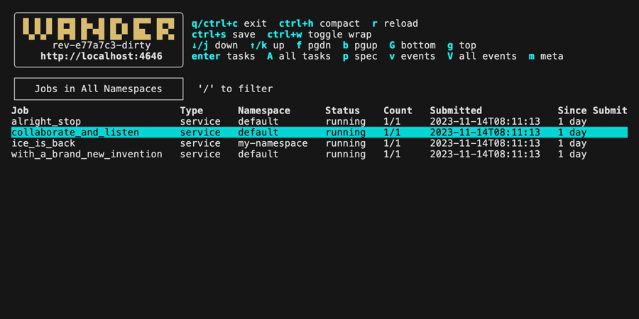

# wander


<p>
    <a href="https://github.com/robinovitch61/wander/releases"></a>
    <a href="https://pkg.go.dev/github.com/robinovitch61/wander?tab=doc"></a>
    <a href="https://github.com/robinovitch61/wander/actions"></a>
</p>

An efficient terminal application/TUI for interacting with your [HashiCorp Nomad](https://www.nomadproject.io/) cluster.

- Browse jobs, allocations, and tasks
- Live tail logs
- Tail global or targeted events
- Exec to interact with running tasks
- View resource usage stats (memory, CPU)
- See full job or allocation specs
- Save any content to a local file

`wander` is written with tools from [Charm](https://charm.sh/).

[Feature requests and bug reports are welcome](https://github.com/robinovitch61/wander/issues/new/choose).

## Demo



[Screenshots](./img/screenshots#readme)

## Flow Diagram


## Installation

The following options are available depending on your platform and tooling:

```shell
# homebrew
brew install robinovitch61/tap/wander

# upgrade using homebrew
brew update && brew upgrade wander

# nix-shell
# ensure NUR is accessible (https://github.com/nix-community/NUR)
nix-shell -p nur.repos.robinovitch61.wander

# nix flakes
# ensure flake support is enabled (https://nixos.wiki/wiki/Flakes#Enable_flakes_temporarily)
nix run github:robinovitch61/nur-packages#wander

# arch linux
# PKGBUILD available at https://aur.archlinux.org/packages/wander
yay -S wander-bin

# with go (https://go.dev/doc/install)
go install github.com/robinovitch61/wander@latest
```

You can also download [prebuilt releases](https://github.com/robinovitch61/wander/releases) and move the unpacked
executable to somewhere in your `PATH`, e.g. `/usr/local/bin`.

## Usage

Run the app by running `wander` in a terminal. See `wander --help` and config section below for details.

## Configuration

`wander` can be configured in three ways:

1. Command line arguments, visible by running `wander --help`.
2. Environment variables. These map to the configuration file below (e.g. `nomad_addr` in yaml is the `NOMAD_ADDR`
   environment variable).
3. A yaml config file at `$HOME/.wander.yaml`, or a custom config file path passed to the `--config` argument. Complete
   example below.

Priority in order of highest to lowest is command line arguments, then environment variables, then the config file.

Example yaml file showing all options (copy this into `$HOME/.wander.yaml` and uncomment/edit as desired):

```yaml
# Nomad address. Default "http://localhost:4646"
#nomad_addr: "http://localhost:4646"

# Nomad token
#nomad_token: ""

# Nomad region
#nomad_region: ""

# Nomad namespace. Default "*"
#nomad_namespace: "*"

# Nomad http auth, in the form of "user" or "user:pass"
#nomad_http_auth: ""

# Path to a PEM encoded CA cert file to use to verify the Nomad server SSL certificate
#nomad_cacert: ""

# Path to a directory of PEM encoded CA cert files to verify the Nomad server SSL certificate. If both cacert and capath are specified, cacert is used
#nomad_capath: ""

# Path to a PEM encoded client cert for TLS authentication to the Nomad server. Must also specify client key
#nomad_client_cert: ""

# Path to an unencrypted PEM encoded private key matching the client cert
#nomad_client_key: ""

# The server name to use as the SNI host when connecting via TLS
#nomad_tls_server_name: ""

# If True, do not verify TLS certificates. Default False
#nomad_skip_verify: False

# Seconds between updates for job & allocation pages. Disable with -1. Default 2
#wander_update_seconds: 2

# Columns to display for Jobs view - can reference Meta keys. Default "Job,Type,Namespace,Status,Count,Submitted,Since Submit"
#wander_job_columns: "Job,Type,Namespace,Status,Count,Submitted,Since Submit"

# Columns to display for Tasks for Job view. Default "Node ID,Alloc ID,Task Group,Alloc Name,Task Name,State,Started,Finished,Uptime"
#wander_tasks_for_job_columns: "Node ID,Alloc ID,Task Group,Alloc Name,Task Name,State,Started,Finished,Uptime"

# Columns to display for All Tasks view. Default "Job,Node ID,Alloc ID,Task Group,Alloc Name,Task Name,State,Started,Finished,Uptime"
#wander_all_tasks_columns: "Job,Node ID,Alloc ID,Task Group,Alloc Name,Task Name,State,Started,Finished,Uptime"

# If True, start with compact header. Default False
#wander_compact_header: False

# If True, start in All Tasks view. Default False
#wander_start_all_tasks: False

# If True, remove unnecessary gaps between table columns when possible. Default True
# If you want column positions to remain static as you scroll and filter, set this to False
#wander_compact_tables: True

# Log byte offset from which logs start. Default 1000000
#wander_log_offset: 1000000

# If True, start with filtering active on first view. Default False
#wander_start_filtering: False

# If True, filtering highlights and allows cycling through matches, but does not remove surrounding context. Default True
#wander_filter_with_context: True

# If True, follow new logs as they come in rather than having to reload. Default True
#wander_log_tail: True

# If True, copy the full path to file after save. Default False
#wander_copy_save_path: False

# Topics to follow in event streams, comma-separated. Default "Job,Allocation,Deployment,Evaluation"
# see https://www.nomadproject.io/api-docs/events#event-stream
#wander_event_topics: "Job,Allocation,Deployment,Evaluation"

# Namespace used in stream for all events. "*" for all namespaces. Default "default"
#wander_event_namespace: "default"

# The jq (https://stedolan.github.io/jq/) query used for parsing general events. "." to show entire event JSON. Default is:
#  .Events[] | {
#    "1:Index": .Index,
#    "2:Topic": .Topic,
#    "3:Type": .Type,
#    "4:Name": .Payload | (.Job // .Allocation // .Deployment // .Evaluation) | (.JobID // .ID),
#    "5:ID": .Payload | (.Job.ID // (.Allocation // .Deployment // .Evaluation).ID[:8])
#  }
# The numbering exists to preserve ordering, as https://github.com/itchyny/gojq does not keep the order of object keys
#wander_event_jq_query: >
#  .Events[] | {
#    "1:Index": .Index,
#    "2:Topic": .Topic,
#    "3:Type": .Type,
#    "4:Name": .Payload | (.Job // .Allocation // .Deployment // .Evaluation) | (.JobID // .ID),
#    "5:ID": .Payload | (.Job.ID // (.Allocation // .Deployment // .Evaluation).ID[:8])
#  }

# The jq (https://stedolan.github.io/jq/) query used for parsing allocation-specific events. "." to show entire event JSON. Default is:
#  .Index as $index | .Events[] | .Type as $type | .Payload.Allocation |
#  .DeploymentStatus.Healthy as $healthy | .ClientStatus as $clientStatus | .Name as $allocName |
#  (.TaskStates // {"":{"Events": [{}]}}) | to_entries[] | .key as $k | .value.Events[] | {
#    "0:Index": $index,
#    "1:AllocName": $allocName,
#    "2:TaskName": $k,
#    "3:Type": $type,
#    "4:Time": ((.Time // 0) / 1000000000 | todate),
#    "5:Msg": .DisplayMessage,
#    "6:Healthy": $healthy,
#    "7:ClientStatus": $clientStatus
#  }
# The numbering exists to preserve ordering, as https://github.com/itchyny/gojq does not keep the order of object keys
#wander_alloc_event_jq_query: >
#  .Index as $index | .Events[] | .Type as $type | .Payload.Allocation |
#  .DeploymentStatus.Healthy as $healthy | .ClientStatus as $clientStatus | .Name as $allocName |
#  (.TaskStates // {"":{"Events": [{}]}}) | to_entries[] | .key as $k | .value.Events[] | {
#    "0:Index": $index,
#    "1:AllocName": $allocName,
#    "2:TaskName": $k,
#    "3:Type": $type,
#    "4:Time": ((.Time // 0) / 1000000000 | todate),
#    "5:Msg": .DisplayMessage,
#    "6:Healthy": $healthy,
#    "7:ClientStatus": $clientStatus
#  }

# For `wander serve`. Hostname of the machine hosting the ssh server. Default "localhost"
#wander_host: "localhost"

# For `wander serve`. Port for the ssh server. Default 21324
#wander_port: 21324

# For `wander serve`. Host key path for wander ssh server
#wander_host_key_path: ""

# For `wander serve`. Host key PEM block for wander ssh server
#wander_host_key_pem: ""

# Custom colors
#wander_logo_color: "#DBBD70"
```

## SSH App

`wander` can be served via ssh application. For example, you could host an internal ssh application for your company
such that anyone on the internal network can `ssh -p <your-port> <your-host>` and immediately access `wander` without
installing or configuring anything.

Optionally, users can pass in their own nomad token with `ssh -p <port> <host> -t <token>`. The `-t` argument does not
stand for token - it forces `ssh` to allocate a pty.

Serve the ssh app with `wander serve`.

## Trying It Out

You can try `wander` out by running a local development nomad cluster following [these instructions](https://learn.hashicorp.com/tutorials/nomad/get-started-run?in=nomad/get-started):

```sh
# in first terminal session, start and leave nomad running in dev mode
sudo nomad agent -dev -bind 0.0.0.0 -log-level INFO

# in a different terminal session, create example job and run it
nomad job init
nomad job run example.nomad

# run wander
wander
```

## Manually Specifying the `wander` Version

`wander` uses [carlmjohnson/versioninfo](https://blog.carlmjohnson.net/post/2023/golang-git-hash-how-to/) to expose
version/revision info. If the environment in which you're installing wander does not allow for git repos, prebuilt 
binaries, or `go install`, then you can manually specify the output of `wander --version` at build time as follows:

```sh
go build -ldflags "-X github.com/robinovitch61/wander/cmd.Version=vX.Y.Z"
```

In this case, you're responsible for ensuring the specified version is in sync with what is actually being built.

## Development

To manually build:

```shell
git clone git@github.com:robinovitch61/wander.git
cd wander
go build  # outputs ./wander executable
```

The [scripts](/scripts) directory contains various development helper scripts.

If the `WANDER_DEBUG` environment variable is set to `true`, the `dev.Debug(s string)` function outputs to `wander.log`.
